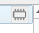

# Get QGIS Set Up

Side note: Most of these can be done from the GUI, but I prefer keyboard shortcuts so that's what the instructions will favor.

1. Open up QGIS and create a new project (Ctrl-N). This will provide a workspace to import all the files. Hit Ctrl-S to save it somewhere safe.
1. Ctrl-L opens up the Data Source Manager. This tool imports the previously downloaded files into QGIS.
    1. Add any shapefiles as vector files (usually ending in .shp). Note that if the shapefiles are from the Census Bureau, they have a bunch of metadata that can be safely ignored, the .shp files is the only one that needs to be imported.
    The default settings work fine.
    1. Add the DEM as a raster file. Again, defaults are fine here.
1. If all went well, it should look similar to this
[![qgis_initial_import][1]][1]

> As a quick aside, the files will be rendered from bottom to top, with the newer ones drawing over the older ones. Click and drag to rearrange, or use the checkbox to hide layers temporarily.

# Making Contours

We're ready to make some contours. This is where things start to get subjective, so feel free to do what looks best, these are my suggestions.

## Stitching Files (Optional)

If the desired region spans more than one DEM file, the layers can be merged together with the Merge tool, under "Raster -> Miscellaneous -> Merge...". Select the input layers with the three dots on the right side of the "Input Layers" box and then press "Run". 

> Note that this creates a temporary or scratch layer (denoted by the small computer memory chip ), which are not saved and will be lost if the project is closed. If desired, save these layers by right clicking on it and then selecting "Make permanent". 

## Smoothing Out The Surface

Skipping straight to contour generation produced some very jagged edges, and the contour lines will eventually end up as the cut lines for the wood, so some smoothing may be desired. Since this will involve filtering, it's useful to have a little data on the edges that can be thrown away to avoid the filter startup effects. If the map size is too large and the following steps are slow, feel free to skip to [Trimming To Size](#trimming-to-size) and use a slightly larger area than the final size.

1. In the "Processing Toolbox" on the right side, under "GRASS", select `r.neighbors` as shown: [![filter_setup][4]][4] (As a brief aside, this does not appear to be how the professionals do it. See "A design of contour generation for topographic maps with adaptive DEM smoothing" [^contour] for more information).
1. Choose a number of neighbors and click "Run". More neighbors will result in more smoothing and a longer runtime. A few notes:
    1. If none of the neighborhood operations perform the desired function, it's possible to use a [custom filter](https://grass.osgeo.org/grass82/manuals/r.mfilter.html). 
    1. It should be possible to speed up this filtering operation, especially for large neighborhoods, using something akin to `fftconvolve`, but I have yet to find a way to do it without some additional plugins. If you find something better, please open an [issue in the repo](https://github.com/ARamsey118/wooden_topo_map/issues/new)!

## Contour Generation

The contour generation process has one main consideration, contour spacing. This influences the number of contours, and therefore the number of wooden layers (which in turn, sets the thickness of the map).
1. The Yosemite map elevations run from 478 to 3,440. [![layers_elevation][5]][5]
    
    This data is in meters, but different datasets may follow different conventions and use different datums.
1. For this example, let's say that the map should have about eight layers. That would translate to \$\frac{3440-478}{8} = 370.25\$. This can either be left as is, or rounded as desired. The following examples use 400m contour lines.
1. Select Raster -> Extraction -> Contour..., then pick the desired layer (likely called "neighbors" from the neighbor filter that ran). Enter the contour spacing as "Interval between contour lines".
    1. (Optional) If the contours should be offset (e.g. 200, 600, 1000) instead of starting at zero (e.g. 400, 800, 1200), enter the offset in "Offset from zero relative...".
    1. (Possibly Required) My version of QGIS has a bug where contours won't save properly to temporary files and have to be written to disk. This can be done by selecting a file towards the bottom of the window (Scroll down to find "Contours" "Save to a temporary file").
1. Press Run

Here's the contours I got after my first run with 101 neighbors:

[![neighbors_101][6]][6]

I decided some more smoothing would be good, so I went back re-did the filtering with 201 neighbors:

[![neighbors_201][7]][7]

This is very much a matter of personal opinion so a few iterations may be necessary to find something that looks good.

There may be a few contour lines which are too short to add any real value and would be annoying to assemble. To remove them
1. (I'll copy the instructions over later so this guide is standalone, but for now the instructions at <https://theshamblog.com/making-a-laser-cut-topo-map-the-design-phase/>, step 3)

# Feature Preparation

## Trimming To Size

It's fairly easy to trim, or in QGIS terminology clip, the map to size using a vector outline of the desired shape/size. 

### Create A Vector
There are several methods for generating the vector outline, here's two:

* Create a grid with a precise size/aspect ratio[^grid]
    1. From the Processing Toolbox on the right side, search for and open the "Create Grid" tool.
    1. Fill in the various fields and click run, which should result in one or more rectangles being placed on the map [![grid_creation][2]][2]
    1. Click on the pencil to edit (highlighted in the previous picture) and then use the "Select Features by Area or Single Click" tool above the pencil to highlight the undesired rectangles. [![select_part][3]{: .align-right}][3]
    1. Click the trash can to the right of the pencil to delete the selected features. Repeat as necessary until only one feature remains.
    1. Save the layer so it can be used for future clipping.
* Draw it on the map
    1. First, create a new layer with Layer -> Create Layer -> New Shapefile Layer...
    1. Name it and select type "Polygon". Then press "Ok" to add it to the Layers list.
    1. Click the pencil to "Toggle Editing", then press Ctrl+. to "Add a Polygon Shape".
    1. Right-click the main menu and select "Shape Digitizing Toolbar", then pick the desired tool.
    1. Draw the shape. Note that the last click will need to be a right click to finalize the shape.
    1. Click the pencil to stop editing and save changes.
    1. If a "Feature Attributes" box pops up, hit "Ok"

> Double click a layer and pick "Symbology" to change how it is displayed on the map. For layers such as the clipping vector, it's helpful to decrease the opacity so the other layers can be seen simultaneously.

> There's a "Scale Feature" tool that is handy for creating a slightly larger outline to help with [Smoothing Out The Surface](#smoothing-out-the-surface).

### Trim The Map
Each layer will have to be trimmed. 

Only the vectors (contours, streets, etc.) will actually be exported, so trimming rasters is optional.
1. Select Rasters->Extraction->Clip Raster By Mask Layer... The raster will be the Input Layer and the newly created vector will be the Mask Layer. 
1. (Optional) Scroll down to save it to a file.
1. Hit Run.

For vectors, the process is similar, but the tool is located under Vector->Geoprocessing Tools-> Clip.... The Input Layer will be clipped and the Overlay layer will be the new border.

Here's the map after this step is completed, with the map extent in light blue shading, contours in dark blue lines, and roads in brown lines.

[![clipped][8]][8]

## Dividing Features By Contour Line
Since each contour is the boundary of a different piece of wood, the features (roads, waterways, etc) need to be divided up such that they can be etched individually onto the wood.
1. Convert the map extent polygon to lines using Vector->Geometry Tools->Polygons to Lines...
1. Merge the newly clipped contour lines and freshly created map outline using Vector->Data Management Tools->Merge Vector Layers... Click the three dots next to the "Input Layers" box to select the two layers
1. Translate the merged line layer back to polygons using "Vector Geometry->Polygonize" from the Processing Toolbox.
[![polygonize][9]][9]
    If the output is missing some polygons, there's probably a misalignment between the extent lines and the contour lines, which can happen if the contour lines were generated from a raster that was (almost) the same size as the extent, instead of being clipped down to size.
1. Using the same Clip tool as before, select the feature layer as the "Input Layer" and the new polygons as the "Overlay layer". Click the green arrows [![iterate][10]][10] to iterate over the polygon layer one polygon (i.e. contour or wood piece) at a time. The result will be a lot of layers, so it's useful to save to a file instead of creating temporary layers.
[![roads_split][11]][11]
    Note how the roads change color as they cross the contour lines, indicating that they're now separate layers.

Repeat for each feature.

# Exporting
Under construction

# Area Estimation
Under construction, but here's some links to get started
* https://gis.stackexchange.com/questions/288390/getting-the-bounding-box-for-each-feature-in-the-source-layer-in-qgis
* https://docs.qgis.org/3.16/en/docs/user_manual/processing_algs/qgis/vectorgeometry.html#multipart-to-singleparts
* https://gis.stackexchange.com/questions/23355/calculating-polygon-areas-in-shapefile-using-qgis?rq=1
* https://gis.stackexchange.com/questions/301845/summing-data-from-column-in-attribute-table-in-qgis

[^contour]: <https://doi.org/10.1080/23729333.2017.1300998>
[^grid]: <https://gis.stackexchange.com/questions/313349/how-to-make-a-rectangle-of-an-exact-size-aspect-ratio-in-qgis>
[1]: ./pictures/qgis_initial_import.png
[2]: ./pictures/grid_creation.png
[3]: ./pictures/select_part.png
[4]: ./pictures/filter_setup.png
[5]: ./pictures/layers_elevation.png
[6]: ./pictures/neighbors_101.png
[7]: ./pictures/neighbors_201.png
[8]: ./pictures/clipped.png
[9]: ./pictures/polygonize.png
[10]: ./pictures/iterate.png
[11]: ./pictures/roads_split.png
